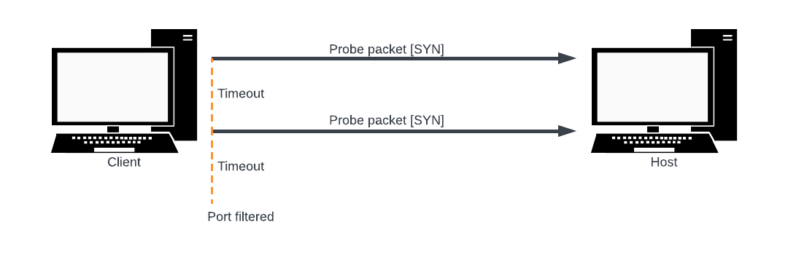

# IPK25 Project 1 - OMEGA: L4 Scanner

Simple TCP and UDP network L4 scanner for *Linux*, implemented in *C* programming language.

#### Author

- [@Marek Pazúr (xpazurm00)](https://www.github.com/0x6b6)

### Content structure
- [Documentation](#documentation)
   - [Theory](#theory)
     - [L4 network scanning](#l4-network-scanning)
     - [TCP SYN Scan](#tcp-syn-Scan)
     - [UDP ICMP Scan](#udp-icmp-port-unreachable-scanning)
     - [Checksum](#checksum)
     - [Pseudo headers](#pseudo-headers)
   - [Implementation details](#implementation-details)
     - [Parameter parsing](#parameter-parsing)
     - [Scanning](#scanning)
     - [Network and utilities](#network-and-utilities)
     - [Compilation](#compilation)
   - [Testing](#testing)
     - [Testing devices](#testing-devices)
     - [Testing environment](#testing-environment)
     - [Testing tools used](#testing-tools-used)
     - [Test cases](#test-cases)
- [Execution](#execution)
   - [Parameter specification](#parameter-specification)
- [Additional features](#additional-features)
- [License](#license)
- [Bibliography](#bibliography)
## Documentation
This document includes
- Executive summary of the theory necessary to understand the functionality of the implemented application
- Implementation details
- Testing details

## Theory

### L4 network scanning
Port scanning is a method for discovering useful communication channels on a host. The core idea is to probe as many ports as possible, ideally while remaining undetected, and track which ports are open or closed [1]. 

The port scan process involves sending requests to a range of server port addresses to identify receptive ports and determine the available services on the target machine [2]. 

There are many port scanning methods, in this project, the TCP SYN scan and UDP scan methods are specifically used, which will be described later on.

The responses can be classified in three categories
- open
- closed
- filtered

### TCP SYN Scan
Also referred to as "half-open" scanning, as this method simulates the three-way handshake of the reliable TCP protocol without fully completing it [2].

The *advantages* of this method are that it is relatively lightweight and can be performed quickly on a fast network without firewall bottlenecks. Most importantly, it is stealthy, as it does not complete the full handshake, making detection more difficult [4].

First step to initiate a *three-way handshake* is to create a TCP packet with the *SYN* flag set and send it to the target host to scan the desired port(s) [4].

Now there are three options of whats about to happen in the second step [4]
- Target host sends a response with *SYN, ACK* flags set back
- Target host sends a response with *RST* flags set back
- No response is received

Since this method is using the TCP protocol, it is much easier to evaluate the port status.

If the host responds with *SYN-ACK*, the port is confirmed to be open for communication.

Normally, the last step would be to send a *RST* flag set packet to terminate the connection with the target host, since it would keep sending the SYN-ACK response. However, this step is unnecessary, as the operating system kernel automatically sends an RST packet when it receives an unexpected SYN-ACK response [4].

In conclusion, the port is classified as **OPEN**.


If the host responds with *RST*, the port is confirmed to be **CLOSED**.


If no response is received, it may indicate packet loss, so the *TCP SYN* packet is retransmitted an arbitrary number of times.


If there is still no response, the port is finally classified as **FILTERED**.



### UDP ICMP port unreachable scanning

While the UDP protocol itself is rather simple, the UDP scanning proccess is more difficult when evaluating probed ports state, since the ports are not obliged to send either a acknowledgement or an error response. Only way to achieve evaluation of scanned ports, is to rely on the target host sending an *error ICMP* packet of type ICMP_PORT_UNREACH [11]. This helps to figure out if a port is **CLOSED**, and by exclusion determine which ports are not [2].


The main *disadvantage* of this method is that the UDP protocol is *less reliable* than TCP, and probe packets may fail to reach the target host.
To mitigate this, probe packets should be retransmitted to increase the chances of receiving a response, especially if packet loss is suspected. Another challenge is *rate limiting*, as some hosts restrict the rate of ICMP error responses [3].

In conclusion, this method may *fail* to accurately classify port states and *is generally slower*.

### Checksum
Checksum is a simple, generic algorithm thats serves a purpose of verifying data integrity.

The principle of the algorithm is a 16-bit ones complement sum ensuring data integrity. If the data length is odd, padding is added (but not transmitted) for alignment. The checksum also includes a **pseudo-header** for additional verification to protect against misrouted segments [6].

It prevents corrupted data being delivered, and to do so the sender **MUST** generate it and the receiver **MUST** check it. 

To send probe packets to scan ports, they **MUST** be include the checksum in the protocol headers.

### Pseudo headers
IPv4 (96 bits) and IPv6 (320 bits) pseudo-headers primarily contain the source address of the sender and the destination address of the target host, providing additional protection against misrouted segments [6].

## Implementation details
The program consists of the following source files (located in /src)
- `main.c` Program entry point.
- `net_utils.c` `net_utils.h` Network and utility functions.
- `opts.c` `opts.h` Parameter parsing.
- `scan.c` `scan.h` Port scanning process.
- `Makefile`

where the .h (header files) contain necessary function interfaces.

*Note*: Description is also available in the aforementioned source files.

### Parameter parsing
This section uses `opts.c`, `opts.h` modules to parse command line parameters and prepare the configuration of the program.

#### Configuration structure
```c
typedef struct config {
	char *interface;        // Device interace
	struct ifaddrs *ifaddr; // Interface adress(es) information

	ports_t tcp_ports;
	ports_t udp_ports;

	unsigned int timeout;    // Response timeout
	unsigned int rate_limit; // Rate limit for UDP scanning
	unsigned int retry;      // Number of times a packet should be resent in case of no response

	char *dn_ip;            // Domain name | IP address
	char addr_str[64];      // Buffer of 64 bytes should be enough for any address in ASCII string format

	uint8_t verbose;        // Show details
} cfg_t;
```
List of parsing functions and macros in `opts.c`, `opts.h`:
 - `init_cfg`: Initialises the cfg_t structure
 - `free_cfg`: Releases resources used by cfg_t structure
 - `parse_opt`: Parses specified command line arguments and sets the cfg_t structure accordingly
 - `parse_ports`: Parses various port selection formats 
 - `parse_number`: Parses integers in decimal format
 - `CHECK_PARAM`: Evaluates if a parameter is valid

*Note*: Only `init_cfg`, `free_cfg`, `parse_opt` function interfaces are available to use outside `opts.c`.

#### Parsing
Parameters are parsed by the `parse_opt` function, which iterates through all specified parameters and these are then processed
by other auxiliary functions such as `is_opt`, `parse_ports`, `parse_number` or the `CHECK_PARAM macro`.

At the same time, duplicate parameters, allowed values ​​and ranges, port selection format and specification of required parameters are checked.

The result is an initialized `cfg_t` structure, which determines the conditions of the port scanning process.

### Scanning
This section uses `scan.c`, `scan.h`, `net_utils.h` modules to process data and use essential network functions/utilities to perform port scanning.


#### Scanner structure
```c
typedef struct l4_scanner {
	int socket_fd;                      // Socket file descriptor

	uint16_t source_port;               // Source port (randomized)
	uint16_t destination_port;          // Destination port (selected by input)

	sa_family_t family;                 // Address family (IPv4/IPv6)

	struct sockaddr *source_addr;       // Source address (selected interface)
	struct sockaddr *destination_addr;  // Destination address (derived from host(s) address or domain name)

	socklen_t source_addr_len;          // Source addres length
	socklen_t destination_addr_len;     // Destination address length
} l4_scanner;
```

The entire scanning proccess is defined by these functions in `scan.c`, `scan.h`:
- `start_scan`: Prepares essential data required to start scanning
- `set_scanner`: Initialises the *l4_scanner* struct with the collected data
- `process_ports`: Processes *ports_t* structure and creates a raw socket according to the TCP/UDP protocol 
- `port_scan`: Performs the TCP SYN and the UDP ICMP scans 

#### Starting scan
Before starting the port scan, the IP addresses of both the host and the client must be retrieved.

A DNS query is made using the `getaddrinfo` function to obtain a list of IPv4 and IPv6 addresses for the specified host, which can either be a domain name or a raw IP address. A while loop iterates through the list to ensure that every IP address associated with the host is scanned.

Next, the device interface source address is fetched using the `get_ifaddr` function, based on the IP address family and specified parameters. Specifically, if the host IP address is IPv4, the interface address will also be IPv4, and vice versa.

Once the data is collected, the scanner structure is initialized using the `set_scanner` function, and the *port structures* are prepared for processing, separately for the TCP and UDP protocols.


#### Port processing
Both *TCP* and *UDP* *port structures* are iterated through using for loops. It is distinguished whether it is a *range* or a *list*.

```c
typedef struct ports {
	unsigned int access_type; // Either a range or a list

	struct range {
		unsigned int from;
		unsigned int to;
	} range;

	unsigned int *port_list;
	size_t list_length;
	size_t list_capacity;
} ports_t;
```
In order to create and be able to send custom protocol packets, a raw socket with the specified protocol (TCP or UDP) must be created using function `create_socket` and bound to the chosen interface. Additionally, the communication of the sockets is set to be **non-blocking network I/O**, since polling will be used later on to wait for responses.


#### Port scanning
At this stage, the port scanning process begins. However, a few preparations are required, such as assembling the packet to be sent and setting up the response socket.

`Packet assembly` is responsible for constructing the protocol packet. This function follows a structured pipeline where the protocol header is created, configured (addressing, checksum, etc.), and then encapsulated within an IP header [9].

**Important**: Custom IP header creation is not used, as the operating system automatically generates one. However, if needed, it can be manually created using the create_iphdr function.

If the current protocol is `TCP`
- A packet with TCP header and the *SYN, ACK* flags set is created [5].
- The response socket is set to the already created raw socket since a TCP response is expected.
- The custom TCP probe packet is sent using the TCP raw socket.

If the current protocol is `UDP`
- A packet with UDP header is created [7].
- Response receive socket is set to a new socket, created using mentioned `create_socket` function, with ICMP or ICMPV6 as the protocol type, since ICMP response is expected [11].
- Custom UDP probe packet is sent using the UDP raw socket.

Finally, the scanner waits for a response using `poll` function.

Since packet loss can occur at any time, the probe packet may not reach the target, resulting in no response. Depending on the `--resend` parameter, the probe packet will be resent a specified number of times before classifying the port as filtered (*for TCP*) or open (*for UDP*).

If a response packet arrives, it is first filtered through the `filter_addresses` function before being passed to `extract_data` for evaluation. 


Depending on the protocol, the corresponding protocol head is extracted from the packet and filtered through the `filter_ports` function. 

Finally, the port state is classified:

If the current protocol is `TCP`
- Response packet has SYN-ACK flags → port is **OPEN**
- Response packet has RST-ACK flags → port is **CLOSED**
- Otherwise port is **FILTERED**

If the current protocol is `UDP`
- Response ICMP(V6) packet has type ICMP_DEST_UNREACH and code ICMP_PORT_UNREACH → port is **CLOSED**
- Otherwise port is **OPENED**

### Network and utilities
This section describes `net_utils.c`, `net_utils.h` modules containing essential network and utility functions used by the scan process.

List of important function interfaces in `net_utils.h`:
- `get_interfaces`: Fetches interface(s) list.
- `get_ifaddr`: Fetches specified interface source address.
- `addr_to_string`: Converts IPv4/IPv6/MAC adresses from binary to ASCII string.
- `list_interfaces`: Prints active interfaces with their address and state.
- `create_socket`: Creates a raw socket bound to interface and protocol.
- `close_socket_fd`: Closes socket file descriptors.
- `create_prot_header`: Creates a TCP/UDP header.
- `create_prot_header`, `create_pseudo_ipv6_h`: Creates a pseudo IPv4/IPv6 header structure to be later used in checksum.
- `calculate_checksum`: Calculates checksum of given data [8].
- `create_iphdr`: Creates IPv4/IPv6 header. Ready to be used, but is **not** currently used in the project.
- `packet_assembly`: Creates a TCP/UDP packet ready to be sent.
- `filter_addresses`: Filters out misrouted packets by addressess.
- `filter_ports`: Filters out misrouted packets by ports.
- `extract_data`: Extracts data from response and evaluates port state.

List of auxiliary private functions defined in `net_utils.c`:
- `service`: Prints service of a port by protocol.
- `rate_limit`: Rate limit setting for UDP scanning.
- `hexdump_packet`: Prints the content of a packet in hexadecimal format.
- `print_if_flags`: Prints the status of the interface.

### Compilation

The program is compiled using the **GCC** compiler with the following flags:

```bash
gcc -std=c17 -Wall -Wextra -Werror -D_GNU_SOURCE -Wpedantic
```
## Testing

#### Testing devices
- Desktop PC with ethernet cable connection (eth0, ens33) (AMD Ryzen 7 5800X3D (2) @ 3.399GHz)
- Laptop with wireless connection (wlo1) (Intel Core i5-12450H (2) @ 2.199GHz)

#### Testing environment
- OS: Ubuntu 22.04.5 LTS x86_64, Kernel: 6.8.0-52-generic, Host: VMware Virtual Platform
- OS: Ubuntu 24.04.2 LTS x86_64, Kernel: 6.11, Host: Oracle VirtualBox 1.2
- OS: Ubuntu 24.04.1 LTS x86_64 (reference virtual machine IPK25_Ubuntu24.ova), Kernel: 6.8.0-52-generic, Host: Oracle VirtualBox 1.2

#### Network configuration
- Network Address Translation (NAT) is enabled.

#### Testing tools used
- nmap: Similiar functionality.
- netcat: Simulate open ports.
- wireshark: Track network traffic.
- ping: Network connectivity diagnostics.
- ping6: IPv6 network connectivity diagnostics.
- valgrind: Memory leaks
- lsof: Track file descriptors

*Test files can be found in the tests directory.*

### Test suite
- Parameter parsing
	- `parse_test.sh`
- Port scan results
  - `simple_test.sh`
  - `nc_test.sh`
  - `tcp_test.sh`
  - `udp_test.sh`
- Memory handling
	- `memory_test.sh`

#### Parameter parsing
It is crucial to ensure the parsing functionality works as intended, so that the scanner correctly interprets and processes
the input parameters. This gurantees that the program behaves as expected.

The test case `parse_test.sh` verifies that the input parameters are properly parsed, validated and interpreted.

It includes tests for both valid and invalid inputs, including various edge cases, such as:
- Port formating
- Valid port range
- Valid ports
- Possible parameter combinations
- Parameter duplicity
- Parameter argument duplication

The program inputs are various combinations of parameters, trying to cover all of the mentioned cases.

All tests are expected to pass, actual outputs of the script can be generated and printed to standard output by executing the script.

#### Port scan results
The most important part to test, the scanner core. It is essential to properly test whether the scanner's evaluation results are trustworthy. If not, it could mean incorrect protocol header settings, incorrect checksum calculation, or generally incorrect packet assembly.

As part of the testing of this section, the nmap tool was used for reference, the netcat tool for simulating port opening on a local device, and wireshark for monitoring network traffic.

There are a total of 4 test scripts in the scanning test suite, namely:
  - `simple_test.sh`: A simple TCP SYN/UDP ICMP scanning test on a public network and localhost. In the case of localhost, the netcat tool is used to verify that the scanner correctly captures the opening of ports. 
  - `nc_test.sh`: TCP SYN scan test of localhost using netcat to open specific ports and nmap for reference output, which will then be compared to the scanner output.
  - `tcp_test.sh`: A test focused on TCP SYN scanning of several different hosts on a public network that use both IPv4 and IPv6 addressing. Specifically, ports 21,22,53,80,443,110,143,3389 are scanned to verify the scanner's capabilities. The nmap tool serves as reference output in the test.
  - `udp_test.sh`: Test zaměřený na UDP ICMP skenování několika různých hostů na veřejné síti, kteři využívají IPv4 i IPv6 adresování. Konkrétně jsou skenovány porty 53,161,123 pro ověřaení schopnosti skeneru. Nástroj nmap v testu slouží jako referenční výstup.

The outputs of all test scripts, including the expected reference output (if the script has one, else its printed to STDOUT), are located in directories that correspond to the test name. If Nmap was used for reference output, it is compared to the actual scanner output to verify correct evaluation of the states of the scanned ports.

*Note*: However, there were a few edge cases where nmap evaluated the port as filtered, while the scanner evaluated it as closed, and even in Wireshark, the packets had RST, ACK flags.

For each of the above test scripts, the wireshark tool was used to capture network traffic, which allows for detailed analysis of the scanning process, such as viewing packet headers. This allows for errors in the construction of probe packets to be discovered. The .pcapng files are located in the tests/PCAPs directory.

The .pcapng files may require additional permissions to be opened, use the following command

```bash
  sudo chmod +x *.pcapng
```

#### Memory handling
Memory leaks can lead to serious performance degradation, in the worse case, invalid memory accesses cause abrupt end (e.g, SEGFAULT, SIGSEGV).

The program should **NOT** have any memory leaks or invalid memory accesses.

Therefore the test `memory_test.sh` focuses on memory handling, by executing the scanner program with different configuration and utilizing the dynamic
analysis `Valgrind` memory debugging tool.

If there are any memory issues found, the test script prints *No memory issues detected* to standard output.

Memory test outputs can be found generated in the *memory_result* directory.

#### Other
In addition to the overhead of the test scripts, ping and ping6 were used to verify IPv4 and IPv6 functionality in the test environment, and lsof was used to check the correct closing of file descriptors.

## Execution
*Root privileges are required in order to scan ports.*

Go to source file directory

```bash
  cd ./src
```

Build via make

```bash
  make all
```

Execute the scanner with root privileges

```bash
  sudo ./ipk-l4-scan [-i interface | --interface interface] [--pu port-ranges | --pt port-ranges | -u port-ranges | -t port-ranges] {-w timeout} [domain-name | ip-address]
  {-r resend} {-l rate-limit} {-v verbose}
```
### Parameter specification (arguments)

| Parameter              | Information                               | Allowed values | Default    |
| ---------------------- | ----------------------------------------- | -------------- | ---------- |
|  `-i`, `--interface`   | Device interface (source address)         | Interface name | (Required) |
|  `-t`, `--pt`          | Selection of TCP ports to be scanned      | 1-65535        | (Required) |
|  `-u`, `--pu`          | Selection of UDP ports to be scanned      | 1-65535        | (Required) |
|  `-w`, `--timeout`     | Timeout for target host response [ms]     | 0-UINT max     | `5000 ms`  |
|  `-r`, `--resend`      | Maximum retries of packet transmission    | 0-UINT max     | `1 retry`  |
|  `-l`, `--ratelimit`   | Rate limit for sending UDP packets [ms]   | 0-UINT max     |  `1000 ms` |
|  `-v`, `--verbose`     | Show additional information during scan   | N/A            | N/A        |
|  `-h`, `--help`        | Show help message                         | N/A            | N/A        |

#### Recomendations
- `--interface` It is advisable to select the correct interface and check if it supports IPv4 or IPv6 addressing, if necessary.
- `--timeout` A higher value may improve scan accuracy, but at the expense of speed.
- `--verbose` Useful for debugging or when detailed information is needed
- `--ratelimit` The default value is set to 1000 milliseconds, as many hosts rate-limit ICMP port unreachable messages [10]. The Linux kernel typically limits ICMP destination unreachable messages to one per second, so it **should not** be modified if uncertain [3]. 
- `--resend` Increases the likelihood of receiving a response, as packet loss may occur.

#### Port selection formating
- `x-y` Basic range format (e.g. 80-443)

- `x to y`, `x to `, `to y`  Extended range format:  if one side is blank, it is implicitly treated as the minimum (1) or maximum (65535) of the port range (e.g. 80 to 443; 65350 to; to 80)

- `x`, `x,y,z` Basic list format (e.g. 80, 443, 8080)

*Restrictions*: Selected ports must lie within the range 1-65535. In the case of a range format, the lower limit must not exceed the upper limit, and vice versa.

#### Examples

- Basic functionality
```bash
  sudo ./ipk-l4-scan -i eth0 --pt 80,443 --pu 53-67 www.scanme.org
```
- Extended functionality
```bash
  sudo ./ipk-l4-scan -i wlo1 -t 80to443 -u to67 www.scanme.org -w 1000 -v
```

```bash
  sudo ./ipk-l4-scan www.scanme.org --interface ens33 --pt "53, 80, 443" --pu "21 to 24" --timeout 1000 --ratelimit 100 --resend 2 -v
```

- Display active interface(s)
```bash
  sudo ./ipk-l4-scan -i
```
## Additional Features

- Extended port parsing: 'to', whitespace skip
- Verbose
- Rate limiting
- Transmission retries


## License

This project is licensed under the [GNU GPL-3.0](https://www.gnu.org/licenses/gpl-3.0.html)


## Bibliography

- [1] Wikipedia contributors. *Port scanner* [online]. 2024. Wikipedia, The Free Encyclopedia. Available at:
https://en.wikipedia.org/w/index.php?title=Port_scanner&oldid=1225200572 [Accessed 17 February 2025].

- [2] [Nmap] Gordon Lyon. *The Art of Port Scanning* [online]. Available at:
https://nmap.org/nmap_doc [Accessed 17 February 2025].

- [3] [Nmap] Gordon Lyon. *UDP Scan (-sU)* [online]. Nmap Network Scanning. Available at:
https://nmap.org/book/scan-methods-udp-scan.html [Accessed 17 February 2025].

- [4] [Nmap] Gordon Lyon. *TCP SYN (Stealth) Scan (-sS)* [online]. Nmap Network Scanning. Available at:
https://nmap.org/book/synscan.html [Accessed 17 February 2025].

- [5] [RFC 793] Internet Engineering Task Force. *Transmission Control Protocol* [online]. 1981. DOI: 10.17487/RFC0793. Available at:
https://datatracker.ietf.org/doc/html/rfc793 [Accessed 18 February 2025].

- [6] [RFC 9293] Internet Engineering Task Force. *Transmission Control Protocol (TCP)* [online]. 2022. DOI: 10.17487/RFC9293. Available at:
https://datatracker.ietf.org/doc/html/rfc9293 [Accessed 18 February 2025].

- [7] [RFC 768] Internet Engineering Task Force. *User Datagram Protocol* [online]. 1980. DOI: 10.17487/RFC0768. Available at:
https://datatracker.ietf.org/doc/html/rfc768 [Accessed 18 February 2025].

- [8] [RFC 1071] Internet Engineering Task Force. *Computing the Internet Checksum* [online]. 1988. DOI: 10.17487/RFC1071. Available at:
https://datatracker.ietf.org/doc/html/rfc1071 [Accessed 18 February 2025].

- [9] [RFC 791] Internet Engineering Task Force. *Internet Protocol* [online]. 1981. DOI: 10.17487/RFC0791. Available at:
https://datatracker.ietf.org/doc/html/rfc791#section-3.1 [Accessed 18 February 2025].

- [10] [RFC 1812] Internet Engineering Task Force. *Requirements for IP Version 4 Routers* [online]. 1995. DOI: 10.17487/RFC1812. Available at:
https://datatracker.ietf.org/doc/html/rfc1812#section-4.3.2.8 [Accessed 1 March 2025].

- [11] [RFC 792] Internet Engineering Task Force. *Internet Control Message Protocol* [online]. 1981. DOI: 10.17487/RFC0792. Available at:
https://datatracker.ietf.org/doc/html/rfc792 [Accessed 17 February 2025].

- [12] [RFC 4443] Internet Engineering  Task Force. *Internet Control Message Protocol (ICMPv6)
        for the Internet Protocol Version 6 (IPv6) Specification* [online]. 2006. DOI: 10.17487/RFC4443. Available at:
https://datatracker.ietf.org/doc/html/rfc4443 [Accessed 17 February 2025].
